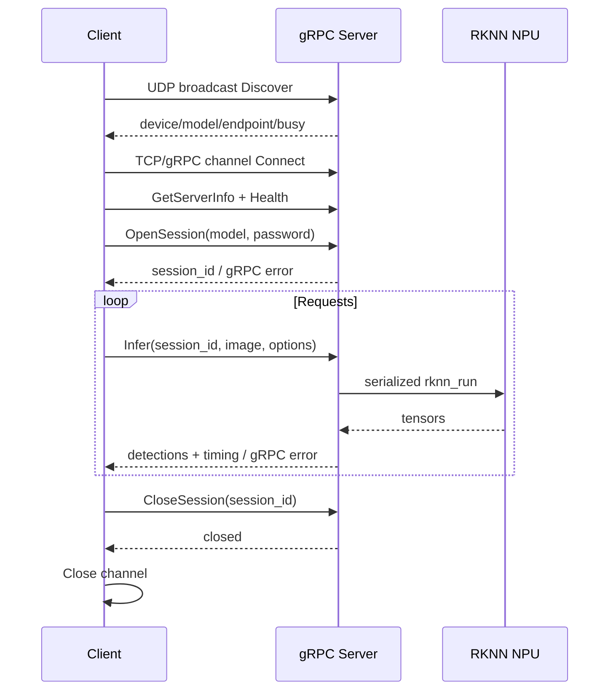

# Luckfox RKNN gRPC Accelerator

将 Luckfox Pico RV1106/RV1103 作为局域网 RKNN 推理加速节点。服务端使用 gRPC C++，除 gRPC 必须的 Service 类外，推理引擎、会话管理和程序入口均采用 C 风格函数与结构体。

当前提供 YOLOv5 JPEG/PNG 单图推理，包含：

- protobuf schema，供 Python、Go、Java、C# 等语言生成客户端。
- `Connect -> OpenSession -> Infer/StreamInfer -> CloseSession` 完整生命周期。
- UDP 局域网扫描发现、密码认证、标准 gRPC 错误码和独占 Session。
- NPU 串行调度，返回排队、解码、推理和总耗时。
- Python SDK 与 Tk 图形客户端，支持图片、本地视频、摄像头及 RTSP/HTTP 视频流检测。
- uClibc 交叉编译、原子部署、启动/停止/日志脚本。

## 目录

```text
proto/                 跨语言 API schema
server/include/        C 风格公开接口
server/src/            gRPC 适配、会话和 RKNN 实现
client/                Python SDK 与 Tk GUI
cmake/                 RV1106 uClibc toolchain
scripts/               构建、测试、部署和代码生成
deploy/                板端进程管理脚本
docs/                  API 与部署文档
tests/                 无硬件主机测试
```

## 快速开始

### 1. 主机检查

```bash
cd /home/ubuntu/workspace/luckfox_rknn_grpc
bash scripts/test_host.sh
```

### 2. 构建 ARM/uClibc 服务端

首次执行会下载并分别构建 host 与 ARM 版本的 gRPC，耗时较长。

```bash
export LUCKFOX_SDK_PATH=/home/ubuntu/workspace/luckfox-pico-SDK-main
bash scripts/build_server.sh
```

产物位于 `dist/luckfox_rknn_grpc/`。

### 3. 部署到开发板

```bash
bash scripts/deploy.sh root@192.168.0.108
ssh root@192.168.0.108 '/root/luckfox_rknn_grpc/start_server.sh status'
ssh root@192.168.0.108 '/root/luckfox_rknn_grpc/start_server.sh logs'
```

服务默认密码为 `19940724`。如需修改，在开发板创建 `/root/luckfox_rknn_grpc/password` 后重启服务；客户端填写相同密码。放行 UDP `50052` 用于扫描发现，TCP `50051` 用于 gRPC 推理。

### 4. 运行 Tk 客户端

```bash
bash scripts/setup_client.sh
source client/.venv/bin/activate
python client/tk_app.py
```

Windows 可使用 Python 创建虚拟环境后运行同一个 GUI：

```powershell
PowerShell -ExecutionPolicy Bypass -File scripts\setup_client.ps1
client\.venv\Scripts\python.exe client\tk_app.py
```

Windows 客户端固定使用 Python 3.12；当前依赖版本不支持 Python 3.14。

连接加速器后，可使用客户端中的 `Local Video` 打开本地视频、`Camera` 打开默认摄像头，或通过 `RTSP / Stream` 输入 RTSP/HTTP 地址。视频播放与推理由独立工作线程处理：播放按视频帧率持续进行，推理只消费最新帧，推理速度不足时自动跳过过期帧。界面分别显示 Playback FPS 与 Inference FPS，`Stop` 可随时停止。

## API 生命周期



详细契约见 [docs/API.md](docs/API.md)，构建与运维见 [docs/BUILD_AND_DEPLOY.md](docs/BUILD_AND_DEPLOY.md)。

## 当前边界

- 服务端目前仅注册 `yolov5`，但 schema 和 session 已支持后续模型注册表。
- 一个加速器仅允许一个客户端持有推理 Session；信息与健康查询仍可用于监控。
- 同一 Session 内的 NPU 请求串行执行，避免同一 RKNN context 并发访问。
- 使用 resize 而非保持宽高比的 letterbox，与当前 Luckfox 示例行为一致。
- gRPC 传输未加密，仅用于可信 LAN 或 WireGuard/Tailscale 网络。